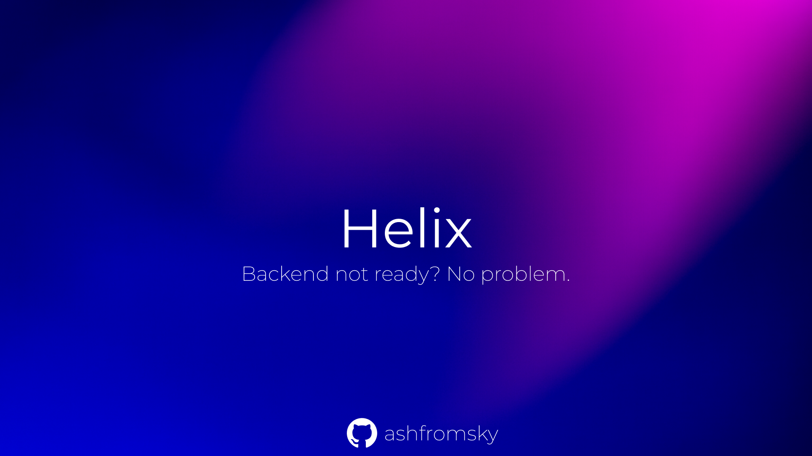
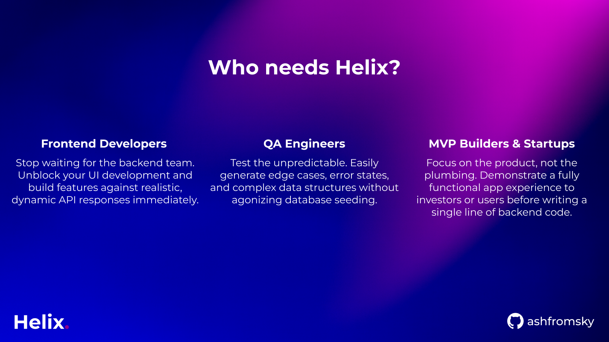
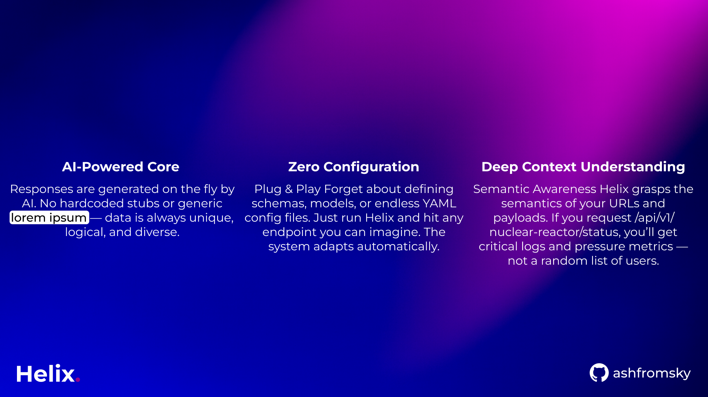
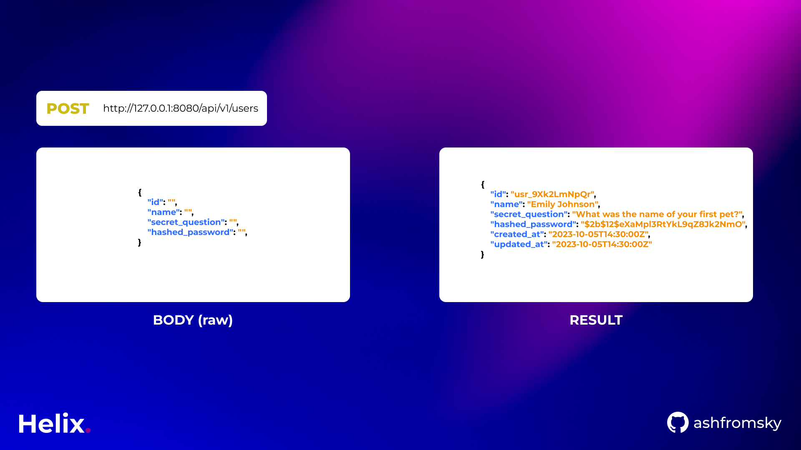
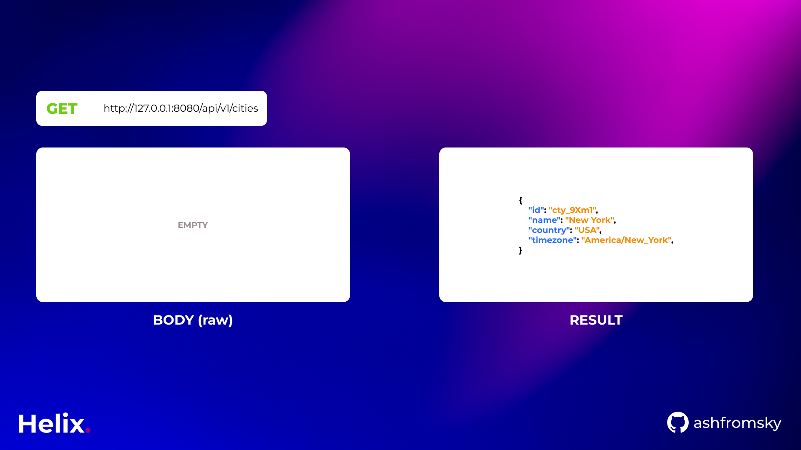
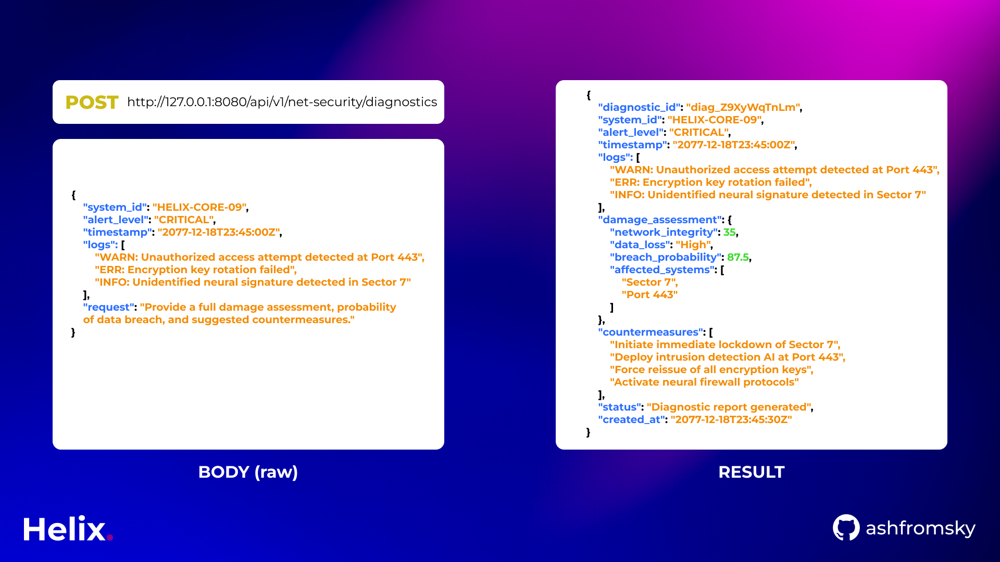

# Helix

> Your Backend not ready? No problem.

[](https://www.python.org/downloads/)
[](https://fastapi.tiangolo.com/)
[](https://www.gnu.org/licenses/agpl-3.0.en.html)
[](https://hub.docker.com/)



**Helix** is an AI-powered API mocking server that generates realistic responses on the fly. Stop writing mock data manually—let AI do it for you.

---

## Why Helix?



### Frontend Developers
Stop waiting for the backend team. Unblock your UI development and build features against realistic, dynamic API responses immediately.

### QA Engineers
Test the unpredictable. Easily generate edge cases, error states, and complex data structures without agonizing database seeding.

### MVP Builders & Startups
Focus on the product, not the plumbing. Demonstrate a fully functional app experience to investors or users before writing a single line of backend code.

---

## Key Features



### AI-Powered Core
Responses are generated on the fly by AI. No hardcoded stubs or generic lorem ipsum—data is always unique, logical, and diverse.

### Zero Configuration
Plug & Play. Forget about defining schemas, models, or endless YAML config files. Just run Helix and hit any endpoint you can imagine. The system adapts automatically.

### Deep Context Understanding
Semantic Awareness: Helix grasps the semantics of your URLs and payloads. If you request `/api/v1/nuclear-reactor/status`, you'll get critical logs and pressure metrics—not a random list of users.

---

## Quick Start

### Using Docker (Recommended)

```bash
# Clone the repository
git clone https://github.com/ashfromsky/helix.git
cd helix

# Start with Docker Compose
docker-compose up
```

Visit `http://localhost:8080` to see Helix in action.

### Local Setup

```bash
# Run setup script
chmod +x setup.sh
./setup.sh

# Activate virtual environment
source venv/bin/activate

# Start the server
uvicorn app.main:app --reload --port 8080
```

---

## Usage Examples

### Creating a User (POST)



Send empty fields in your request body, and Helix automatically fills them with realistic, contextually appropriate data:

```bash
curl -X POST http://localhost:8080/api/v1/users \
  -H "Content-Type: application/json" \
  -d '{
    "id": "",
    "name": "",
    "secret_question": "",
    "hashed_password": ""
  }'
```

**Response:**
```json
{
  "id": "usr_9Xk2LmNpQr",
  "name": "Emily Johnson",
  "secret_question": "What was the name of your first pet?",
  "hashed_password": "$2b$12$eXaMpI3RtYkL9qZ8Jk2NmO",
  "created_at": "2023-10-05T14:30:00Z",
  "updated_at": "2023-10-05T14:30:00Z"
}
```

### Fetching Data (GET)



Request any resource without prior setup:

```bash
curl http://localhost:8080/api/v1/cities
```

**Response:**
```json
{
  "id": "cty_9Xm1",
  "name": "New York",
  "country": "USA",
  "timezone": "America/New_York"
}
```

### Complex Domain-Specific Requests



Helix understands context and generates domain-appropriate responses:

```bash
curl -X POST http://localhost:8080/api/v1/net-security/diagnostics \
  -H "Content-Type: application/json" \
  -d '{
    "system_id": "HELIX-CORE-09",
    "alert_level": "CRITICAL",
    "timestamp": "2077-12-18T23:45:00Z",
    "logs": [
      "WARN: Unauthorized access attempt detected at Port 443",
      "ERR: Encryption key rotation failed",
      "INFO: Unidentified neural signature detected in Sector 7"
    ],
    "request": "Provide a full damage assessment, probability of data breach, and suggested countermeasures."
  }'
```

**Response:**
```json
{
  "diagnostic_id": "diag_Z9XyWqTnLm",
  "system_id": "HELIX-CORE-09",
  "alert_level": "CRITICAL",
  "timestamp": "2077-12-18T23:45:00Z",
  "logs": [
    "WARN: Unauthorized access attempt detected at Port 443",
    "ERR: Encryption key rotation failed",
    "INFO: Unidentified neural signature detected in Sector 7"
  ],
  "damage_assessment": {
    "network_integrity": 35,
    "data_loss": "High",
    "breach_probability": 87.5,
    "affected_systems": [
      "Sector 7",
      "Port 443"
    ]
  },
  "countermeasures": [
    "Initiate immediate lockdown of Sector 7",
    "Deploy intrusion detection AI at Port 443",
    "Force reissue of all encryption keys",
    "Activate neural firewall protocols"
  ],
  "status": "Diagnostic report generated",
  "created_at": "2077-12-18T23:45:30Z"
}
```

---

## Features

- **Zero Configuration** - Make requests to any endpoint, get instant realistic responses
- **AI-Powered** - Supports DeepSeek, Groq, Ollama, or built-in template mode
- **Context Awareness** - Remembers your actions across requests for consistency
- **Smart Data Generation** - Creates realistic names, emails, dates, and IDs
- **Chaos Engineering** - Simulate failures, latency, and errors for resilience testing
- **Redis Caching** - Fast response times with intelligent caching
- **Docker Ready** - Production-ready containerized deployment

---

## Session Management

Use `X-Session-ID` header to maintain context across requests:

```bash
curl -H "X-Session-ID: dev-session-1" \
  http://localhost:8080/api/orders
```

---

## API Endpoints

### System Endpoints

#### `GET /`
Landing page with project information and documentation.

**Response:** HTML page

---

#### `GET /health`
Health check endpoint for monitoring.

**Response:**
```json
{
  "status": "healthy",
  "timestamp": "2024-12-12T10:30:00.000Z",
  "services": {
    "redis": "up",
    "ai_provider": "demo",
    "ai_model": "template-based"
  }
}
```

---

#### `GET /status`
Detailed status information about all services.

**Response:**
```json
{
  "version": "0.1.0",
  "status": "operational",
  "redis": {
    "connected": true,
    "status": "up"
  },
  "ai": {
    "provider": "demo",
    "model": "template-based",
    "fallback_enabled": true,
    "available_providers": ["demo", "deepseek", "groq", "ollama"]
  }
}
```

---

### Dynamic Mock Endpoints

#### `GET /{path:path}`
Get collection or single resource.

**Examples:**

```bash
# Get collection
GET /api/users
GET /api/v1/products
GET /orders

# Get single resource
GET /api/users/123
GET /api/products/prod_abc123
GET /orders/ord_456
```

**Response (Collection):**
```json
{
  "users": [
    {
      "id": "usr_a1b2c3",
      "name": "Sarah Chen",
      "email": "sarah@company.com",
      "username": "schen",
      "avatar": "https://api.dicebear.com/7.x/avataaars/svg?seed=a1b2c3",
      "status": "active",
      "role": "admin",
      "created_at": "2024-12-10T14:30:00Z",
      "updated_at": "2024-12-10T14:30:00Z"
    }
  ],
  "total": 3,
  "page": 1,
  "per_page": 10,
  "has_more": false
}
```

**Response (Single Resource):**
```json
{
  "id": "usr_123",
  "name": "John Doe",
  "email": "john@example.com",
  "created_at": "2024-12-10T14:30:00Z",
  "updated_at": "2024-12-10T14:30:00Z"
}
```

---

#### `POST /{path:path}`
Create a new resource.

**Request:**
```bash
POST /api/users
Content-Type: application/json

{
  "name": "Alice Smith",
  "email": "alice@example.com",
  "role": "developer"
}
```

**Response:** `201 Created`
```json
{
  "id": "usr_d4e5f6",
  "name": "Alice Smith",
  "email": "alice@example.com",
  "role": "developer",
  "created_at": "2024-12-12T10:45:00Z",
  "updated_at": "2024-12-12T10:45:00Z"
}
```

**Headers:**
```
Location: /api/users/usr_d4e5f6
```

---

#### `PUT /{path:path}`
Update entire resource (full replacement).

**Request:**
```bash
PUT /api/users/123
Content-Type: application/json

{
  "name": "Alice Johnson",
  "email": "alice.johnson@example.com",
  "role": "senior-developer"
}
```

**Response:** `200 OK`
```json
{
  "id": "usr_123",
  "name": "Alice Johnson",
  "email": "alice.johnson@example.com",
  "role": "senior-developer",
  "created_at": "2024-12-10T14:30:00Z",
  "updated_at": "2024-12-12T11:00:00Z"
}
```

---

#### `PATCH /{path:path}`
Partial update of resource.

**Request:**
```bash
PATCH /api/users/123
Content-Type: application/json

{
  "role": "team-lead"
}
```

**Response:** `200 OK`
```json
{
  "id": "usr_123",
  "name": "Alice Johnson",
  "email": "alice.johnson@example.com",
  "role": "team-lead",
  "created_at": "2024-12-10T14:30:00Z",
  "updated_at": "2024-12-12T11:15:00Z"
}
```

---

#### `DELETE /{path:path}`
Delete a resource.

**Request:**
```bash
DELETE /api/users/123
```

**Response:** `204 No Content`

---

#### `OPTIONS /{path:path}`
CORS preflight support.

**Response:** `200 OK`
```
Access-Control-Allow-Origin: *
Access-Control-Allow-Methods: GET, POST, PUT, PATCH, DELETE, OPTIONS
Access-Control-Allow-Headers: Content-Type, X-Session-ID
```

---

## Recognized Resource Types

Helix automatically generates appropriate data based on resource names:

| Resource | Generated Fields |
|----------|------------------|
| `users`, `accounts`, `profiles` | name, email, username, avatar, status, role |
| `products`, `items` | name, description, price, currency, sku, in_stock, category |
| `orders`, `purchases` | order_number, total, status, customer_id, items_count, shipping_address |
| `posts`, `articles`, `blog` | title, content, author, slug, published, views, likes |
| `comments`, `reviews` | text, author, rating, likes |
| `tasks`, `todos` | title, description, status, priority, assigned_to, due_date |
| `events`, `meetings` | title, description, start_time, end_time, location, organizer |
| `companies`, `organizations` | name, industry, employees_count, website, email, phone, address |

For unrecognized resources, Helix generates generic but realistic data.

---

## Headers

### Request Headers

| Header | Description | Required |
|--------|-------------|----------|
| `X-Session-ID` | Session identifier for context awareness | No |
| `Content-Type` | Must be `application/json` for POST/PUT/PATCH | Conditional |

**Example:**
```bash
curl -H "X-Session-ID: my-session" \
     -H "Content-Type: application/json" \
     -X POST http://localhost:8080/api/users \
     -d '{"name": "Test User"}'
```

### Response Headers

| Header | Description |
|--------|-------------|
| `Content-Type` | Always `application/json` |
| `Location` | Resource URL (for POST responses with 201) |

---

## Configuration

Copy `.env.example` to `.env` and configure:

```bash
# AI Provider (demo, deepseek, ollama, groq)
HELIX_AI_PROVIDER=demo

# DeepSeek via OpenRouter (free tier: ~500 req/day)
HELIX_OPENROUTER_API_KEY=your-key-here

# Groq (free tier: 14,400 req/day)
HELIX_GROQ_API_KEY=your-key-here

# Local Ollama
HELIX_OLLAMA_HOST=http://localhost:11434
HELIX_OLLAMA_MODEL=llama3
```

### AI Providers

- **demo** - Template-based, no API key needed (default)
- **deepseek** - Via OpenRouter, free tier available
- **groq** - Ultra-fast inference, generous free tier
- **ollama** - Local models, completely offline

---

## Advanced Features

### Chaos Engineering

Enable chaos mode to test error handling:

```bash
HELIX_CHAOS_ENABLED=true
HELIX_CHAOS_ERROR_RATE=0.1      # 10% random errors
HELIX_CHAOS_LATENCY_RATE=0.15   # 15% latency spikes
HELIX_CHAOS_MIN_DELAY_MS=2000   # Minimum delay
HELIX_CHAOS_MAX_DELAY_MS=5000   # Maximum delay
```

### Session Context

Helix maintains context within sessions:

```bash
# Session 1: Create a product
curl -H "X-Session-ID: session-1" \
  -X POST http://localhost:8080/api/products \
  -d '{"name": "Laptop", "price": 1299.99}'

# Session 1: List products - returns the created product
curl -H "X-Session-ID: session-1" \
  http://localhost:8080/api/products

# Session 2: List products - returns different data
curl -H "X-Session-ID: session-2" \
  http://localhost:8080/api/products
```

### Caching

Responses are cached in Redis with the following key structure:
```
{session_id}:{method}:{path}:{body_hash}
```

Default TTL: 24 hours

---

## Architecture

```
helix/
├── app/
│   ├── routes/          # API endpoints
│   │   ├── requestbased/
│   │   │   └── catch_all.py    # Dynamic mock endpoints
│   │   └── ui/
│   │       ├── default.py      # Landing page
│   │       └── health.py       # Health & status
│   ├── services/        # Business logic
│   │   ├── ai/         # AI provider integrations
│   │   │   ├── providers/
│   │   │   │   ├── demo.py     # Template-based
│   │   │   │   ├── deepseek.py # DeepSeek
│   │   │   │   ├── groq.py     # Groq
│   │   │   │   └── ollama.py   # Ollama
│   │   │   ├── manager.py      # Provider manager
│   │   │   └── config.py       # AI settings
│   │   ├── cache.py    # Redis caching
│   │   ├── context.py  # Session management
│   │   └── analyzer.py # Request analysis
│   └── database/        # Redis configuration
├── assets/AI/           # AI system prompts
├── templates/           # Web UI
└── docker-compose.yml   # Container orchestration
```

---

## API Response Format

All AI providers return standardized responses:

```json
{
  "status_code": 200,
  "headers": {
    "Content-Type": "application/json"
  },
  "body": {
    "id": "usr_a1b2c3",
    "name": "Sarah Chen",
    "email": "sarah@company.com",
    "created_at": "2024-12-10T14:30:00Z"
  }
}
```

---

## Requirements

- Python 3.11+
- Redis (via Docker or local installation)
- Optional: AI provider API keys

---

## Contributing

Contributions are welcome. Please open an issue first to discuss proposed changes.

## ⚠️ Security Notice

Never commit your `.env` file or API keys to Git. The `.env.example` is safe to share, but always keep your actual `.env` private.

---

## License

AGPLv3 - See [LICENSE](LICENSE) for details.

---

**Built for developers who want to focus on features, not infrastructure.**